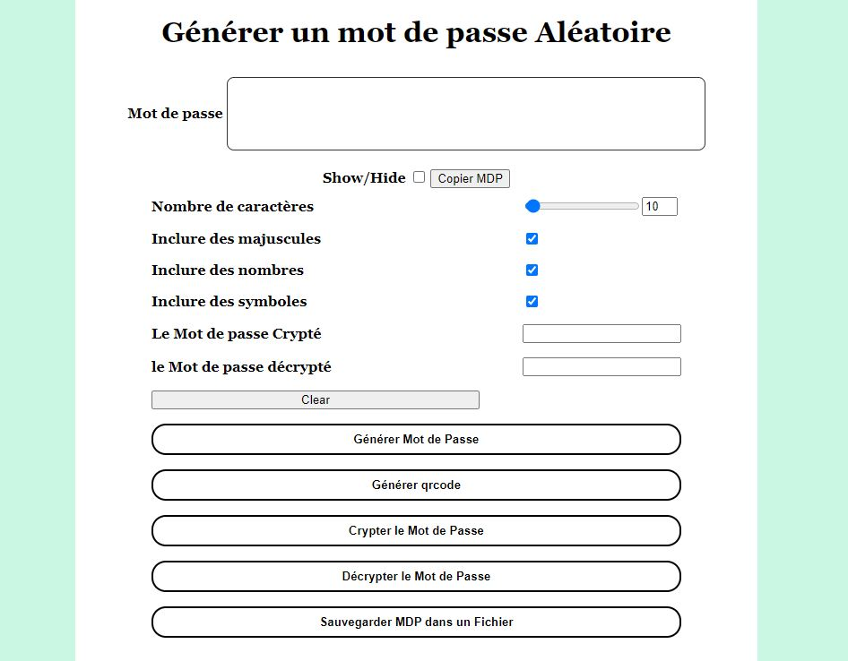

# Password Generator Web

A password generator that provides secure passwords for the average users.

## Context
- This was my final project for school.
- Was reviewed by our professor and obtained a 80/100 degree.
- This is not the first of its kind obviously, except for the way all these features were combined, making the application very convenient for the user.

## Features
- Generating Random Passwords.
- Copying Generated Passwords to the clipboard.
- Specify Password length and characters.
- Encrypt and Decrypt Passwords.
- Turn Generated Password into QR Code.
- Save Generated Password to .txt file.

## Future Steps
- Make Website Responsive
